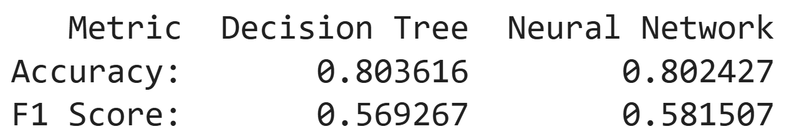

# 🏙️ NYC Airbnb Price Category Classification Model Comparisons
## ℹ️ Overview
This project evaluates two machine learning models and compares their performances to solve a binary classification problem. The NYC Airbnb listings data is used to train a Decision Tree and a neural network to predict the price category of a listing. 

> **Note:** This project was completed as part of Cornell Tech's Break Through Tech program during the Machine Learning Foundations course. The project prompt, dataset, and overall workflow were provided by the program, while the implementation, analysis, modeling, and evaluation were done as part of the course.

### 📂 Dataset
The NYC Airbnb listings data is located in `airbnbListingsData.csv`. It contains information on the properties of various Airbnb listings in New York City. 

The target variable `price_category` is a binary feature that classifies each listing as either low priced or high priced. Listings at or above the 75th percentile of all prices are labeled as `high price`, while the listings below the 75th percentile are labeled as `low price`.

> This dataset was modified by Break Through Tech for its Machine Learning Foundations course. The original dataset is available on Kaggle [here](https://www.kaggle.com/datasets/dgomonov/new-york-city-airbnb-open-data).

### 🧪 Methods Used
* Exploratory Data Analysis
    * Examined class imbalance and feature distributions
    * Inspected and selected predictor features
    * Identified missing values
* Data Preprocessing & Feature Engineering
    * Imputed missing values
    * Created a new feature to improve model performance
    * Implemented one-hot encoding on categorical features
    * Separated target variable and predictor variables
* Machine Learning
    * Developed Decision Tree and neural network models
    * Tuned hyperparameters
    * Scaled data for the neural network
* Data Visualization
    * Plotted histograms and count plots to view imbalance and distributions
* Model Evaluation
    * Compared the performance between the two ML models
    * Discussed trade-offs between accuracy, interpretability, and computational complexity

### 💻 Technologies Used
* Python
* Pandas
* Numpy
* Matplotlib
* Seaborn
* Scikit-Learn
* Tensorflow

### 🧑‍🔬 Results
Both the Decision Tree and the neural network performed similarly to one another based on their accuracy scores. However, the neural network had a slightly higher F1 score. Despite this, the Decision Tree was selected as the preferred model for this problem since it still results in comparable scores, is easier to interpret, and is faster to run.

It is important to note that because the neural network did not have a fixed random seed, it outputs different results each time the model is run. Incorporating a fixed seed, along with addressing class imbalance and including additional features in the dataset, are key areas for future improvements.

Below is an image of the summary table that displays the accuracy and F1 scores of both models:

### 🖱️ Getting Started
1. Clone the repository. See this [guide](https://docs.github.com/en/repositories/creating-and-managing-repositories/cloning-a-repository) for help.
2. Load up the repo in your preferred IDE or in a Jupyter Notebook environment.
3. Create and activate a Python virtual environment. Use version `3.11` of Python as the project was developed and tested in this version.
4. Make sure you have installed all required dependencies from `requirements.txt` before running the notebook.
   * Run `pip install -r requirements.txt`
5. Open `nyc_airbnb_dt_vs_nn.ipynb` and run the notebook. The dataset is located in `airbnbListingsData.csv`.  

The notebook contains the complete workflow from loading and exploring the dataset to evaluating and comparing the machine learning models.
